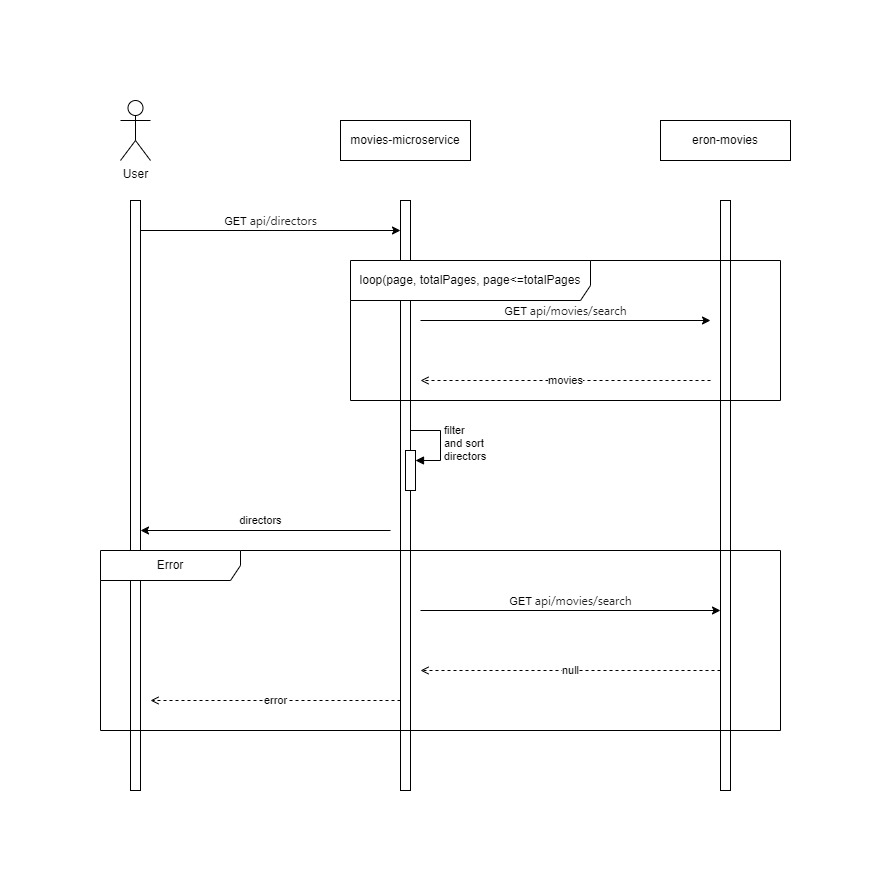

# Movie Directors Microservice

## Overview

This microservice provides a list of the most acclaimed movie directors based on a specified threshold value. The response includes the directors sorted alphabetically.

### Key Features:
- Retrieve a list of movie directors whose acclaim exceeds a configurable threshold.
- The directors are returned as a list of strings in alphabetical order.

---

## API Documentation

The API exposes the following endpoint:

### GET `/api/directors`

**Description:**  
Returns a list of acclaimed movie directors who have directed more movies than the specified threshold.
The microservice fetches data from an external API that provides information about movies, directors, and other related details.

**Query Parameters:**
- `threshold` (required): An integer value representing the minimum number of movies a director must have directed to be included in the response.

**Response:**
- **200 OK**: A list of directors sorted alphabetically.

```json
{
  "directors": [
  "Christopher Nolan",
  "Martin Scorsese",
  "Steven Spielberg"
  ]
}
```

## Swagger Documentation

Swagger is integrated into the microservice to provide interactive API documentation.

Swagger UI: http://localhost:8080/swagger-ui.html

OpenAPI JSON Specification: http://localhost:8080/v3/api-docs


# Setup and Execution

This microservice is built using **Java 17**, **Maven**, and **Spring Boot**. Follow the steps below to set up, build, and run the application.

## Prerequisites

Ensure the following are installed on your system:

- **Java 17** (JDK 17)
- **Maven** (for build automation)
- **Spring Boot** (embedded as part of the Maven dependencies)

## Steps to Run the Microservice

### 1. Clone the Repository

Clone the repository and navigate to the project directory:

```bash
git clone https://github.com/CamiloBoada/movies-microservice.git
cd movies-microservice
```

## Sequence Diagram




## Missing improvements

During the development of this project, I identified several areas where improvements could be made. Below is a summary of what was missing, the reasons behind those decisions, and how they could be addressed in the future.

---

### 1. Javadoc Documentation
**Reason:**  
Javadoc was not included in the initial phases of the project. This was an oversight, as providing clear documentation should have been prioritized from the start to improve code readability and maintainability. Proper Javadoc ensures that anyone working on or maintaining the project can quickly understand the purpose and functionality of each class and method. Adding this documentation late in the project may lead to missed details or rushed explanations.

**Future Action:**  
For future projects, I will ensure that Javadoc is implemented alongside the development process to avoid this issue and improve the overall quality of the codebase.

---

### 2. Additional Unit Tests for Better Coverage
**Reason:**  
Although the core functionality is covered by unit tests, I believe more tests could have been added to cover edge cases, error scenarios, and unexpected inputs. This would have enhanced the reliability of the system and ensured robust error handling.

**Why It Was Not Done:**  
Due to time constraints and the desire to deliver the project within a reasonable timeframe, I decided not to add additional tests. However, if more time were available, I would have implemented more tests to ensure comprehensive coverage, especially for potential error conditions.

**Future Action:**  
In future projects, I will allocate more time for unit testing to ensure all possible scenarios are adequately tested.

---

### 3. Error Handling for Input Data
**Reason:**  
For this project, the input is a simple integer (`threshold`), and additional validation did not seem necessary given the current requirements. Therefore, I focused on implementing the core functionality rather than extensive input validation.

**Future Action:**  
In future iterations, I would consider adding more robust error handling, such as validating required and optional headers or ensuring the input adheres to specific business rules. This would improve the resilience of the system and reduce the likelihood of unexpected issues caused by invalid input.

---

### 4. Switch from WebClient to FeignClient
**Reason:**  
Initially, I used `WebClient` to call the external service, as it is a non-blocking, reactive programming tool. However, upon further investigation, I realized that `WebClient` is better suited for reactive applications. Given the nature of this project, which does not require a reactive approach, I decided to switch to `FeignClient`.

**Benefits of Switching:**
- `FeignClient` integrates well with Spring Boot and makes the external service call simpler and more maintainable.
- The switch allowed me to improve unit testing for the external service call since `FeignClient` can be more easily mocked and tested in isolation.

**Future Action:**  
While `FeignClient` is the better option for this project, I plan to explore more about both clients in the future to fully understand the scenarios where each is most appropriate. This will help me make more informed decisions when selecting the right tool for a given project.

---
